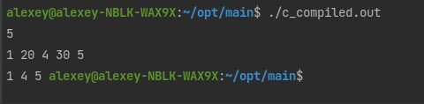
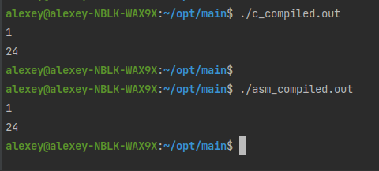
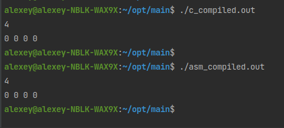
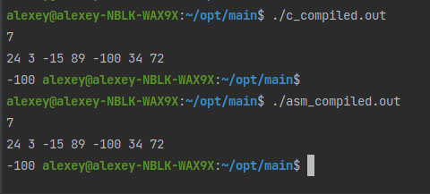
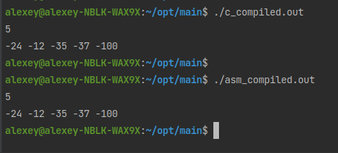

## Файлы
- `main.c` - базовая программа на С
- `c_compiled.out` - базовая программа на C, откомпилированная без модификации ассемблерного кода
- `main.s` - базовая программа на C скомпилированная до уровня ассемблерных команд, которая была откомпилирована с флагами: `-O0 -Wall -S -fno-asynchronous-unwind-tables -fcf-protection=none`, а также модифицирована вручную и дополнена комментариями
- `asm_compiled.out` - запускаемый файл модифицированной программы, скомпилированный без использования опций отладки

## Тестовое покрытие
#### Тесты выполняют функцию проверки корректности работы программы на корректных входных данных. Обусловим формат входных данных :
- Размер подаваемого на вход массива – натуральное число, не превосходящее 100’000.
- Кол-во вводимых чисел совпадает с первым параметром.
- Вводимые числа по модулю не превосходят 10’000

### Тест 1
#### Входные данные
```text
5
1 20 4 30 5
```
#### Ожидаемые выходные данные
```text
1 4 5
```



### Тест 2
#### Входные данные
```text
1
24
```
#### Ожидаемые выходные данные
```text
```


### Тест 3
#### Входные данные
```text
4
0 0 0 0
```
#### Ожидаемые выходные данные
```text
```


### Тест 4
#### Входные данные
```text
7
24 3 -15 89 -100 34 72
```
#### Ожидаемые выходные данные
```text
-100
```


### Тест 5
#### Входные данные
```text
5
-24 -12 -35 -37 -100
```
#### Ожидаемые выходные данные
```text
```
